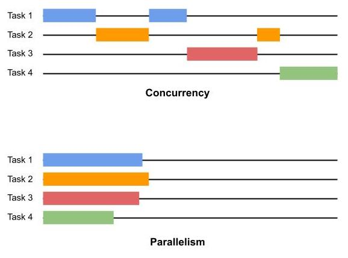

# Async Python Part 2 - A deeper look
<cite>Hariharan Mahadevan(何瑞理), hari@smallpearl.com</cite>

## Background
In the previous [article](https://lsl.sinica.edu.tw/Blog/2023/06/async-python-part-1/) we demonstrated with an example how asynchronous code can achieve massive scalability with the same hardware resources compared to a threaded model. In this example we would go a little bit deeper into async programming, exploring its implementation to further deepen our undertanding of the subject.

## Concurrency vs Parallelism
Before we get into the nitty gritty details, it is useful to have some clarity on the concept of Concurrency vs Parallelism. In computing, concurrency is defined as the ability to execute more than one program or task simultaneously. Parallelism, on the other hand, is the ability to execute multiple tasks or programs <i>at the same time</i>. The difference is subtle and may not be obvious to the casual reader. It means that while concurrency doesn't require that the multiple tasks initiated be active at the same time, parallelism requires just that.

The following picture should help make things clearer.



As you can see, concurrent systems, while allowing multiple tasks to run simultaneously, at any point in time only one task has the CPU's attention. However, in a parallel system, multiple tasks run parallel to each other, usually on independent CPUs (or CPU cores, which are presented as independent CPUs to the OS).

Async Python programs are concurrent and not parallel. Even if you run the Python program on a machine with multiple CPUs, an async Python program runs on a single thread. Exception is when you explicitly spawn threads and schedule a function to run on that thread. But threading is a different subject and it's not the topic of this post.

## Concurrency in Python
As with the previous article, where we demonstrated async benefits with an example, we'll use an example to illustrate concurrency in Python. However, we will not be using the Python provided async constructs. Rather, we will build our own concurrent runner to which various tasks can be queued and the runner's scheduler will dispatch them. But before we jump into that, let's establish some background information.

Consider the following Python code, consisting of two tasks.

```python showLineNumbers
def task1():
  pass

def task2():
  pass
```

If we were to run these, it would look like this(horizontal axis represents CPU execution time). That is, when <i>task1</i> completes, <i>task2</i> gets going. And if you have <i>task3</i>, <i>task4</i>, etc, they all follow the task prior to each.


```
task1()
       task2()
              task3()
```

Assume that we can implement the tasks' algorithms by dividing them into multiple subtasks:

```python showLineNumbers
# Task 1
def task1_part1():
  pass

def task1_part2():
  pass

def task1_part3():
  pass

def task1_part4():
  pass

# Task 2
def task2_part1():
  pass

def task2_part2():
  pass

def task2_part3():
  pass

def task2_part4():
  pass

def task2_part5():
  pass
```

In the concurent system, all we do is to queue up these tasks with a task scheduler and it would execute the individual sub tasks, interspersing each to maximise the processor utilization. The order in which the individual tasks are executed are not quite predictable and depends on the scheduler algorithm and other factors.

```
task1_part1()
             task2_part1()
                          task1_part2()task1_part3()
                                                    task2_part2()
                                                                 task1_part4()
```

As you can see, at any point in time, only one subtask has the Python interpreter thread's attention. When that subtask is completed, another subtask is scheduled to run. This subtask may be the part of the same or different parent task.

One key requirement for this to work is that the subtasks should be able to go through the start/stop/restart cycle while the execution state remains the same between the stop and restart steps. This is not obvious from our sample code above as it does not have any state shared between the different subtasks, but in a real world scenario this would not be the case.

Now we can write code to ensure the consistency of this state (by abstracting it as an object and get all the subtasks to update this object for any changes they make), but then it's additional housekeeping that we have to do. That too for every function to which we would like to apply this divide-and-conquer approach. A lot of work indeed.

What if this housekeeping is provided by the language framework itself?

Well that's what Python async provides you. As we saw in a [previous](https://lsl.sinica.edu.tw/Blog/2023/05/python-generators-a-look-inside/) article, it turns Python language provides just the right infrastructure for this -- the generators framework! To recap, generators are functions (function objects, rather) that can suspend their execution to provide a result to its caller and then resume from where it suspended when asked to do so. Sounds like our concurrent system's requirement, doesn't it?

This generator framework, together with the new keywords, <i>async</i> & <i>await</i> and a scheduler to manage various async tasks and schedule them based on some rules, provide the developers with a neat framework to build efficient & scalable algorithms that better make use of the processor resources.

## Our own concurrency framework
As a last step to deepen our understanding of how generators and async programs are related, let us try and implement a simple concurrent framework ourselves. Note that is an oversimplified version and it's purpose is purely educational.

What we do in this example is to create a bunch of generators, and queue them up with our own <i>async</i> scheduler. The scheduler pops each queued up generator and runs it until it runs out of values to generate. It then moves on to the next queued up generator and so on. This is repeated until the queue is exhausted.

```
# async2_1.py
import random
from collections import deque
from time import sleep

def wait_for_io_result():
    sleep(random.random()/2)

def task1_part1():
    print("task1_part1.1")
    wait_for_io_result()
    yield
    print("task1_part1.2")
    wait_for_io_result()
    yield

def task1_part2():
    print("task1_part2.0")
    wait_for_io_result()
    yield
    print("task1_part2.1")
    wait_for_io_result()
    yield
    print("task1_part2.2")
    wait_for_io_result()
    yield

def task1_part3():
    print("task1_part3.1")
    wait_for_io_result()
    yield
    print("task1_part3.2")
    wait_for_io_result()
    yield
    print("task1_part3.3")
    wait_for_io_result()
    yield
    print("task1_part3.4")
    wait_for_io_result()
    yield
    print("task1_part3.5")
    wait_for_io_result()
    yield

def task1_part4():
  yield from task1_part1()

class MyConcurrentRunner:
    def __init__(self) -> None:
        self.tasks = deque([])

    def create_task(self, coro):
        self.tasks.append(coro)

    def run(self):
        while self.tasks:
            next_task = self.tasks.popleft()
            while True:
                try:
                    next(next_task)
                except StopIteration:
                    break


if __name__ == '__main__':
    runner = MyConcurrentRunner()
    runner.create_task(task1_part1())
    runner.create_task(task1_part2())
    runner.create_task(task1_part3())
    runner.create_task(task1_part4())
    runner.run()
```

What we have done is create a few generator functions, each of which <i>yields</i> a value after sleeping a random interval. The sleep is not relevant and is there to simulate a time consuming IO intensive background operation. Also, the sleep slows down the print messages, which helps us track and visualize the program's run progress much better.

Then, we created a class <i>MyConcurrentRunner</i>, which allows generators to be queued to it. Thereafter when its <i>run()</i> method is invoked, we execute the queued generators in a round-robin fashion by calling the built in <i>next()</i> with the generator popped from the queue.

While this is greatly oversimplified, Python's async framework works in a similar manner. The <i>MyConcurrentRunner</i> here is the event loop in async Python and the generator functions that we created are the <i>async</i> functions that we write. While here we explicitly queue the generators to our <i>MyConcurrentRunner</i> instance, in async Python, this happens implicitly when we <i>await</i> on an an async routine by calling it using the <i>await func()</i> syntax.

Of course Python's event loop is way more complex. It allows other types of async routines such as timer routines to be queued up, which when they expire the eventloop scheduler calls. The queued up routines are also scheduled in a more first-to-finish-first-served manner than our fixed order of queuing up.

Also, Python's event loop provides I/O multiplexing using the system's standard [selectors](https://docs.python.org/3/library/selectors.html) module. This is what allows the TCP echo server in our previous article's code to scale immensely.

A note about selectors. Selectors are an OS level concept and Python selectors are a wrapper around this OS API. If you want to learn more on selectors just type from the terminal:

```
$ man select
$ man poll
```

Man pages for both these functions describe them as <i>synchronous I/O multiplexing</i>. Essentially these functions allow sockets to be queued up with OS so that when there's any network activity around the socket (in/out traffic or connection), it's reflected in the corresponding file descriptor returned by the function. The functions also allow you to specify a timeout value (which can be set to 0), after the elapse of which the function returns irrespective of the queued up sockets' state.

Python <i>selectors</i> use this API and the async counterparts of socket API are implemented using the <i>selectors</i> library.


## Proof is in the pudding
It might surprise you to learn that the concurrency example above is a lot closer to the async event loop implementation than you may think. Async functions are represented by a <i>coroutine</i> object, much like generators are represented by a <i>generator</i> object. And <i>coroutine</i> is a specialization of a <i>generator</i> object. The primary difference between the two is that <i>coroutine</i> can be invoked with arguments (multiple times) whereas <i>generator</i> only emits values until it runs out of values to emit.

If you're still not convinced that generators form the basis for async Python, perhaps this little experiment will finally provide you the proof.

Consider the code below.

```
# async2_2.py
import dis

def gtask2():
    yield 10

def gtask1():
    yield from gtask2()

async def atask2():
    pass

async def atask1():
    await atask2()

# Disassemble both the generator task and the async task
dis.dis(gtask1)
dis.dis(atask1)
```
Run the above program from the terminal. You'll get the following output:

```
$ python async2_2.py

gtask1 disassembly:-
  8           0 LOAD_GLOBAL              0 (gtask2)
              2 CALL_FUNCTION            0
              4 GET_YIELD_FROM_ITER
              6 LOAD_CONST               0 (None)
              8 YIELD_FROM
             10 POP_TOP
             12 LOAD_CONST               0 (None)
             14 RETURN_VALUE
atask1 disassembly:-
 14           0 LOAD_GLOBAL              0 (atask2)
              2 CALL_FUNCTION            0
              4 GET_AWAITABLE
              6 LOAD_CONST               0 (None)
              8 YIELD_FROM
             10 POP_TOP
             12 LOAD_CONST               0 (None)
             14 RETURN_VALUE
```

Look at the bytecode at line 8 of both the functions. <i>YIELD_FROM</i>!

The <i>YIELD_FROM</i> in <i>atask1</i> corresponds to the <i>await atask2()</i> call and is essentially retrieving values emitted by the <i>atask1</i> coroutine, which in turn is a specialized <i>generator</i> object.

## Conclusion
I hope this discussion helped deepen & clarify your understanding of asynchronous programming in Python and convince you of its close relationship with generators. While the content here is mostly conceptual and meant to give you an overview of how an async program is managed by the runtime, it's model is surprisingly similar to how things work in the real async event loop.

*<small>Hariharan is a software developer turned entrepreneur running his own software business in Taiwan. He has over 30 years of hands-on development experience in domains ranging from device drivers to cloud based applications and still enjoys coding.</small>*
