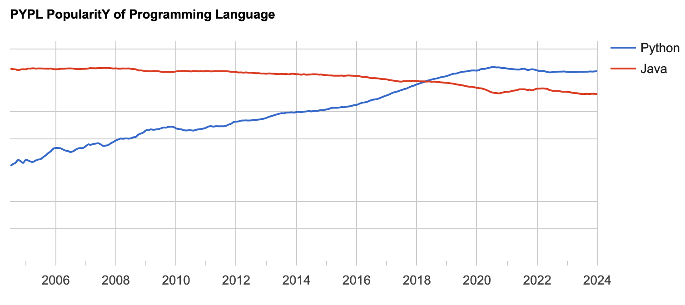

# Choosing a Web Framework
<cite>Hariharan Mahadevan(何瑞理), hari@smallpearl.com</cite>

## Background
In the previous [article](https://lsl.sinica.edu.tw/Blog/2023/10/evolution-of-web-frameworks/) we discussed what is a web framework and traced its evolutionary path to the current state. To reiterate what we discussed there, a web framework is a software library that supports the development of web sites and applications by providing reusable components to automate the the common activities performed in web development such as database access, user management, access control, session management, etc.

In this article we will be identifying certain characteristics of web frameworks and listing the general factors that ought to be considered before choosing one for a project. Since there are literally tens (or even a hundredd or more) web frameworks, it is important to have an idea on how to select one that is best suited for a project.

## How to choose a framework
Given the plethora of web frameworks that are available out there, how does one choose a framework for a given project? Though all the frameworks achieve the same thing, that is, translate an idea or a requirement into a website that will serve its users well, they have different strengths and weaknesses. Having some idea on these pros and cons will go some way in choosing a framework that is the right fit for your prject.

So our attempt is to structure this process into a few specific factors answers to which will help you choose the right framework for the job at hand.

## Factors to consider
These factors are not in any order of importance. Each project and its constraints determine which of the following is more important than others.

### Availability of Skills
Having a readily available programmer resources is one of the key factors in choosing a framework. If you have a bunch of developers who are well versed in a language, it makes perfect sense to choose a framework that is written using that language. There are exceptions though. If the language is a compiled language such as C/C++, you might be hard pressed to find a framework that have enough deployments to justify it's selection. The next best thing you can do is pick a framwork in a language that closely matches the syntax of the language skillset that you already have. In this case Python quite closely matches the verbal syntax of C/C++. Basic programming constructs like control statements, loops & array declarations look and feel similar. So the developers do not have to start from scratch.

### Language popularity
Choosing a framework that uses a popular language can be critical in finding additional resources when the project demands it. The project could be a proof of concept that can be executed by two engineers over a couple of months. But if the proof of concept achieves its set goals and the decision makers decide to grow it into a full fledged project, the team would require additional resources. In times like this it helps if the PoC was developed in a language that is popular in the geography of the project.

The following table lists various programming languages in their order of popularity. Python, Java & JavaScript occupies the top three spots. PHP & TypeScript(the strictly typed cousin of JavaScript) does not do all that well. Naturally one would be inclined to choose a framework that employs one of Python, Java or JavaScript.

| Language | Share | 1-year trend |
|-----------|------|--------------|
| Python | 28.2 % | +0.5 % |
| Java | 15.73 % | -0.9 % |
| JavaScript | 8.91 % | -0.6 % |
| C/C++ | 6.8 % | -0.0 % |
| C# | 6.67 % | -0.3 % |
| R | 4.59 % | +0.6 % |
| PHP | 4.54 % | -0.7 % |
| TypeScript | 2.92 % | +0.2 % |
| Swift | 2.77 % | +0.6 % |

The following diagram shows the trends in language popularity.

However, the data above is based on statistics taken [globally](https://pypl.github.io/PYPL.html), which may not hold true for the local geography. For instance, if you take a Taiwan perspective, anecdotal evidence suggests that PHP is still extremely popular amongst web developers. But anecdotal evidence cannot be relied upon unless we really do not have any other source.

Since I could not find a quotable statistics (perhaps owing to my language handicap), I used a crude way to come up with some data regarding language popularity here. The approach I used was to search the popular local recruitment website `www.104.com.tw` for each language keyword above and list the number of results for each. While not scientifically accurate, given that the same conditions apply for all the languages, the results cannot be ignored. Anyway, here's what I found:

| Lanauge | # of job listings |
|----|---|
| PHP | 13653 |
| Python | 11151 |
| C# | 11051 |
| JavaScript | 11017 |
| C++ | 10521
| Java | 10061 |
| TypeScript | 6728 |
| Go | 8403 |
| R | 8210 |
| Rust | 6220 |

By going by the data above, the anecdotal evidence that I mentioned earlier holds true. PHP may not be popular worldwide, but it remains a popular language in Taiwan. In other words, lacking any other influencing factors, in spite of PHP being low in the global popularity list, selecting a PHP based web framework may not be such a bad decision after all.

## Problem nature & constraints
The problem nature is a key influencing factor in choosing the right framework. This is best illustrated with an example or two.

Imagine the objective of the website is to allow its users to upload a few images (perhaps pictures from a microscope) that is to be analyzed by a set of libraries provided as a Python package. In this case it makes perfect sense to use a Python based web framework as that would allow quick and tight integration with the Python based image analysis library.

On the other hand, the image analysis could be done be a remote server only available via HTTP API and the analysis could take many seconds to even minutes to complete. In this case the web framework should be one that supports asynchronous programming so that many requests could be queued without each request freezing up the CPU. This principle was explained in detail, with working examples in a previous article [here](https://lsl.sinica.edu.tw/Blog/2023/08/async-python-part-2-a-deeper-look/).

And if the analysis could take hours to complete, an altogether different approach ought to be considered. One solution could be a framework that allows jobs to be submitted and the results to be notified offline via an email. Frameworks that use languages such as Go lends itself nicely to this kind of requirement. Python, again is another language (though only because it provides an all encompassing framework) that can help develop elegant designs that meet this kind of requirement.

## Comprehensiveness
A web application is way more than a pretty layout. Typical web applications would require some form of user registration and login management. It has to have a way of composing a webpage using reusable pieces of code so that common features of different pages can be abstracted out into reusable HTML fragments.

Some of the essential capabilities of a web framework can be identified as:-

* Template lanauge for HTML fragment reuse
* User management
* Database access
* Session management
* Access control
* JSON API generation

Frameworks are typically of two kinds -- those come fully loaded supporting all the above or those that come with the bare minimum and then offer each of the above as optional packages that you have to add & configure yourself.

Unless one has deep knowledge and expertise on web frameworks, a safe bet is to go with a framework that comes fully loaded with all the necessary features to develop a complete website. 

While examining each framework and identify its compliance for the above criteria is beyond the scope of this article, the table below lists a summary of a few of the popularl frameworks with respect to their comprehensiveness.

| Framework | Language | Comprehensive | Bare |
|-----------|----------|--------------|------|
| Express | JavaScript | | 
x
 |
| Next.js | JavaScript |  | 
x
 |
| ASP.NET | C# | 
x
 | |
| JBoss   | Java | 
x
 | |
| Spring | Java | 
x
 | |
| Django | Python | 
x
 | |
| Flask | Python |  | 
x
 |

## Framework maturity

A mature web framework is one that has not only been around for many years, but which has many active deployments in production sites.

There are a few Perl language based frameworks that have been around for a long time. However, the number of production sites that use a Perl based framework are quite miniscule when compared with other frameworks that use Python, Java or JavaScript.

A mature framework will also tend to have less frequent major updates as opposed to a nascently developed one. Hoewever, it will be one which has an official organization (virtual or otherwise) consisting of a dedicated team of maintainers who take pride anad ownership in releasing updates. And major version updates should not result in too many breaking changes to existing code and should provide a migration path.

A mature framework will also be one which provides built-in security features to counter common web attacks such as Cross Site Scripting (XSS) & SQL injection.

## Open source vs Proprietary

*<small>Hariharan is a software developer turned entrepreneur running his own [software business](https://smallpearl.com) in Taiwan. He has over 30 years of hands-on development experience in domains ranging from device drivers to cloud based applications and still enjoys coding.</small>*
