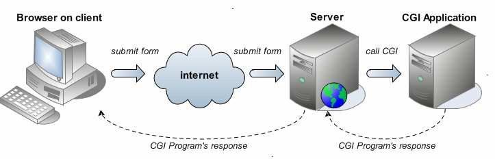
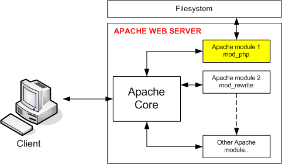
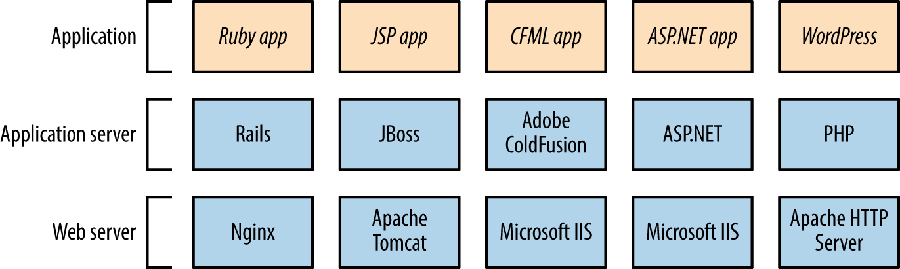

# Evolution of Web Frameworks
<cite>Hariharan Mahadevan(何瑞理), hari@smallpearl.com</cite>

## What is a Web Frameowrk
Web framework is a software framework designed to support the development of web sites and applications. They provide a standard way to build and deploy web applications and provide software tools to automate the overhead associated with common activities performed in web development such as database access, user management, access control, session management, etc. The fundamental objective of a web framework is to promote code reuse by reducing repetitive tasks into a common set of reusable components.

In this article, we will trace the evolution of web frameworks from its early days to its current form, while identifying the reasons for the transition in technology. As there are literally hundreds of web frameworks, covering all of which is impractical, we will only be using major transition points in the technology trends.

## Early days
In its very early days, the Web consisted of a web server (CERN's [httpd](https://en.wikipedia.org/wiki/CERN_httpd) and later [Apache](https://en.wikipedia.org/wiki/Apache_HTTP_Server)) that listened for requests from web browsers and returned an HTML response. The servers could be configured such that based on different request paths, it would return different responses. This was fine for static content such as product information, documents or chapters of a book. For example different documents could be indexed by by different request paths and similarly different chapters could be index by the chapter number, thereby allowing the client to retrieve the document or chapter of interest directly. This path organization also helped reduce the amount of data being transferred resulting in better response times.

But as the web became interactive, whereby it allowed users to input data and the response dynamically generated based on the input, this mechanism of serving statically defined pages became quite limiting.

## CGI
The response from the server designers to accommodate this requirement was to allow external programs to be executed from the server. Such external programs are passed certain arguments (via the standard program command line) and its response, written to <i>stdout</i>, is returned back to the client as the response. Arguments included data that is input by the user in the browser (supplied as form data) alongwith additional standard arguments such as cookies, session identifier, request origin, browser language, etc. The response would be complete HTML text that the browser can render as if it came from a static content. The type, content & structure of the arguments that were passed to the external programs and their response was standardized and this standard was referred as CGI or [Common Gateway Interface](https://en.wikipedia.org/wiki/Common_Gateway_Interface).

CGI brought dynamism to the otherwise static web. Also, since these were pure processes, they could be written in any language. C, C++, Java, Python, Perl, you name it. Even as a shell script! As long as the language allowed you to parse the command line arguments and write back to the stdout, it could be used to write a CGI script. This made it immensely flexible and powerful.

CGI, however, also had two major drawbacks.

Since each script was executed as a separate process which was created as and when the request was received, it became quite resource intensive. This is because creating a new process is a very resource intensive operation -- both in terms of memory and CPU. It was observed that more often than not the initial setup expense of a CGI script far exceeded the cost of the actual computation done by it. As the web grew exponentially and consequently the number of HTTP requests handled by a server grew, CGI as a means of providing interactivity to the web proved to be not a scalable solution.

Another big drawback of CGI was security, or lack thereof. Since the CGI programs are processes launched by the web servers, they inherit the security context of its parent process, the web server. So if a web server is running with the highest OS privileges (as was often the case) the CGI script will also be run as a high privilege process. Since user input (typically form input from the browser) was passed directly to the CGI programs, attackers found ways to embed commands in this input and cause these commands to execute at the server resulting in serious security breaches.

## Apache Server Modules (mods)
One of the solutions to address the scalability issues that plagued CGI was to extend the server via Multiprocessing Server Modules or <i>server mods</i>. Mods are dynamically loadable modules to which requests can be delegated from the main server. Being dynamically loaded, modules run within the Apache server process. Mods can handle the requests either by launching new processes or separate threads as per the mod's design. Once the request is processed, mods would send the response back to the core server which then sends it back to the client. 

Though MPM sounds like a generic term, it was first developed by Apache and one of their first implementations was <i>mod_perl</i>, a module that allowed [Perl](https://www.perl.org/) scripts to be executed from within the Apache server without having to start a Perl interpreter for each incoming request. The same design approach was later adopted in other servers such as [NGINX](https://www.nginx.com/).

Note that by convention MPMs are named with the prefix <i>mod_</i> followed by the mod's name.

Another benefit of <i>mod_perl</i> was that it could emulate a CGI environment, which allowed existing Perl CGI scripts to be executed resulting in a performance boost while help retain them without having to be re-written. Since PHP, one of the first dedicated web framework languages, was written in Perl, mod_php could be developed leveraging on the embedded Perl engine and that too resulted in achieving great scalability improvements over a pure CGI approach.

While running within the server process brings efficiency, it also raises a significant issue. An error in a module, can bring the entire server down. Also, modules cannot have isolated security restrictions that are stricter than the core server. Finally, modules have to be predefined in the server configuration to be loaded and cannot be dynamically restarted (though later versions of Apache added this capability) for maintenance activities such as updates & upgrades.

It merits mentioning that in spite of these shortcomings, Apache modules have proven to be popular and continue to be in use even today. However, their use has been limited more towards administering the Apache server via embedded scripts than act as a server for a production web application.

## FastCGI
Another solution to address the scalability issues, was FastCGI.

In FastCGI, instead of creating a separate process for each external script, it uses a persistent process to serve multiple requests. The HTTP server and the FastCGI process communicate via a Unix or TCP socket. The incoming request details, that were earlier passed as arguments to the CGI script, are now passed to the FastCGI script via the socket connection. The response from the script, received via the same socket connection is then relayed back to the browser client.

Note that using a socket connection allows multiple requests to be handled simultaneously by making multiple connections to the FastCGI process or by launching multiple FastCGI processes (each bound to a different socket, conforming to predefined range of port numbers) or a combination of both.

Since new processes need not be created for each incoming request, this addressed the scalability issues faced by the CGI mechanism. Besides, being a socket connection, the FastCGI process could be run in a different security context than the webserver thereby improving the security risks of the CGI approach.

Another benefit of separating the FastCGI process from the web server is that these processes can be independently restarted after an update (or to reclaim memory caused by leaks) without resulting in total outage to the static portions of the website.

Unfortunately FastCGI also has its limitations, which are quite similar to that of Apache modules. Though comparable to MPMs, FastCGI did not quite gain the popularity of modules. Perhaps because it was a binary protocol and developed by a private company whereas Apache & its modules was community driven and therefore an open standard.

## Frameworks that apply design patterns
The idea behind design patterns is to divide software application's various elements into specific contexts so as to bring clarity to the overall application design. Once an element's context is clear, its goal can be clearly defined which in turn will help define its inputs & outputs.

As the web grew, web applications became more and more complex. Consequently, software design patterns that helped manage the complexity of large software application inevitably made its way into web applications too. Design patterns such as [Model-View-Controller](https://en.wikipedia.org/wiki/Model%E2%80%93view%E2%80%93controller) that were used to bring clarity into large-scale software applications were applied to web frameworks.

As web applications started being architected & designed at a high level using design patterns, it became evident that languages such as Perl, which hitherto were being used to provide dynamism to websites, are inadequate. More expressive programming languages were required to translate the design into code that captured the pattern as closedly as possible. This is the genesis for the many modern web frameworks that we see in use today. Some prominent examples(just a random sampling and by no means exhaustive) are [ASP.NET](https://dotnet.microsoft.com/en-us/apps/aspnet), [JBoss(Wildfly)](https://www.wildfly.org/), [Ruby on Rails](https://rubyonrails.org/) and [Django](https://djangoproject.com).

While some of these frameworks use the MVC pattern, others such as Django employ what is called a MVT (Model-View-Template) pattern. But the idea is the same -- provide clear context to different portions of the code and assign specific roles & responsibilities to each context, resulting in consistent design throughout a large application codebase.

Besides scalability, the advantage of these frameworks is the minimum security that they guarantee. By forcing the application to fit within the framework, web applications inherit the minimum security guarantees that the framework offers. For instance, most of these frameworks, by default require production sites to be served over HTTPS. Also, operations that result in changes to the backend data require additional precautions (often provided by default by the framework) in the code all but eliminating risks posed by common low-cost attacks by hackers -- [Cross Site Scripting](https://en.wikipedia.org/wiki/Cross-site_scripting) & [Cross-site request forgery](https://en.wikipedia.org/wiki/Cross-site_request_forgery) being two of them.

Note that all these frameworks run on their own application servers, which is shown in the diagram. These application servers communicate with the HTTP server using a clearly defined protocol, which is conceptually not too different from how CGI & FastCGI works. But all the application servers support network transport as the communication medium, which allows application servers to be hosted in separate machines and often replicated across many machines for massive scalability.

## AJAX & jQuery
While neither AJAX nor jQuery are true frameworks, they merit a special mention in our discussion on the evolution of web frameworks.

As web applications became more interactive, the browser side application UI became more complex. Some of these UI interactions required context sensitive data related to user input to be retrieved from the server. For example a user searching for a street should only have to enter the first few letters of the street name and the UI should respond by listing all streets that match the letters input by the user.

Delivering such complex & time sensitive UI interaction by re-rending the entire webpage would be a wastage of server resources. A more efficient approach would be to query the server for the relevant data (in this case street names matching the user input) and use the values returned to modify the HTML page already rendered by a previous full page request's response.

In order to facilitate this, browsers provided a dedicated JavaScript API to send a background request to the server and process the results. Browsers also allowed such JavaScript code to modify the displayed HTML page contents in the background by adding new HTML elements or removing and amending existing HTML tags.

This dedicated API is called [AJAX](https://en.wikipedia.org/wiki/Ajax_(programming)), which is an abbreviation for Asynchronous JavaScript and XML. As the name suggests AJAX requests to server typically returned JavaScript objects or XML data. JavaScript objects are encoded in [JSON](https://en.wikipedia.org/wiki/JSON), allowing them to be directly loaded into JavaScript scripts and worked upon.

Whereas AJAX provides a standard way to retrieve data from a remote in the background, adding & modifying the HTML page using the plain JavaScript API bundled with the browser was proving to be a pain. Enter [jQuery](https://jquery.com/). jQuery provided a fast & small library of wrapper functions that made the job of finding, modifying & adding HTML elements a breeze.

Together, these two key innovations suddenly made web applications interactively ricker and closer than ever before to statically installed desktop applications.

However AJAX & jQuery were not without their drawbacks.

Server logic became increasingly complex as it now consisted of two kinds of response types. Some requests resulted in full HTML pages being returned whereas other requests returned pure data encoded as JSON (or in some rare cases XML). Of course application servers returning pure JSON data simplifies applications server code as it does not have to deal with composing messy HTML page fragments. I call it messy as HTML being a declarative language is not easy to be broken down into components and maintained independently.

At the same time client computers became more & more powerful. Power that was not being fully utilized by the browser rendering a web application. Also, JavaScript became an omnipresent capability in web browsers which made writing web applications that rely on it less and less risky to being rendered non-functional.

What if all the work required to construct the frontend of a web application UI be delegated to the client thereby restricting the server code to just managing the data and the business logic? This would simplify the server code which would help achieve even greater scalability while making maitenance that much easier. Moreover, since UI is managed entirely from the browser, it can be made even more responsive.

This line of thought resulted in the next major evolutionary phase in web frameworks.

## JavaScript Frontend Frameworks
JavaScript based frontend frameworks render the entire HTML page locally at the browser. They do this by running JavaScript code, which is retrieved from the server. This is the contemporary evolutionary phase that we are in right now.

Example for JavaScript based frontend frameworks are [Angular](https://angular.io/), [React](https://react.dev/) & [Vue.js](https://vuejs.org/), amongst others.

In these frameworks, the application server is responsible for primarily two functions:

- Provide access to the data & manipulate them through a well defined interface
- Deliver the latest application code as JavaScript bundles

The JavaScript bundles contain the entire application code and run in the browser fetching essential data from the server and building an HTML user interface for the user. This HTML is then injected into the browser window resulting in the application UI. When user invokes an application feature or triggers an action (like clicking a button or a link or entering a value into a text field), the relevant code goes on to build a new interface (or modifies the existing one) by composing new HTML fragments and injecting them into the browser's view. This process goes on endlessly until the user quits the app.

This mechanism completely removes the logic of building the HTML response for a given request from the server. Server only has to provide a means to access the data & in cases where the data needs to be changed, validation of the inputs before changing it. The server also incorporates the business logic (such as cascading effects on related data) of what happens when data is thus modified.

An added benefit of using JavaScript frontend frameworks is that it allows clear separation between frontend & backend code bases. This has other couple of significant consequences.

Firstly, it allows development of these two to progress independently of each other as long as the interface remains the same.

Secondly, this model allows organizations to hire independent developers with specialized skills suiting the domain thereby achieving higher code quality and programmer productivity.

Lastly, pure JavaScript based frontends can be written in such a way that it can be converted into a mobile app with minimal effort. And such mobile apps can be deployed in both Android and iOS platforms, from a single code base with minimal additional effort to handle platform specific vagaries.

## Conclusion
I hope this article gave you an insight into way the web has evolved to result in what we have today. This is by no means complete and overlooks a key trend -- mechanisms for live interaction via browser. By mechanism for live interaction, I'm referring to features such as live chat and streaming. Both these features require data to be pushed by the server to the client, after the client initiates a request expressing interest in the data. If time permits, we will explore this in a little bit more detail in one of the future articles.

*<small>Hariharan is a software developer turned entrepreneur running his own [software business](https://smallpearl.com) in Taiwan. He has over 30 years of hands-on development experience in domains ranging from device drivers to cloud based applications and still enjoys coding.</small>*
